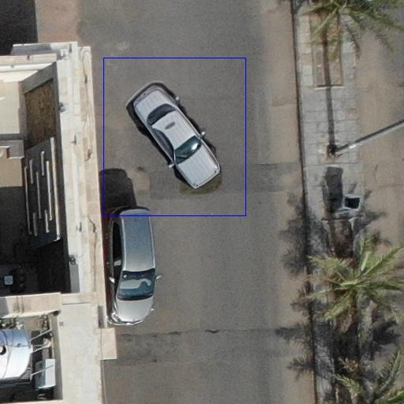
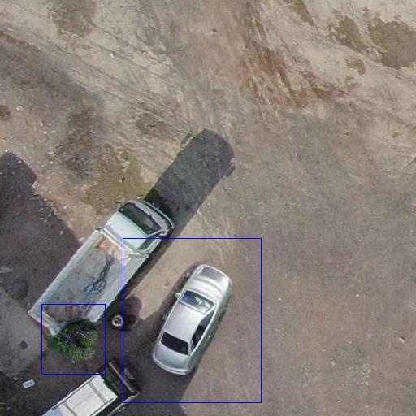
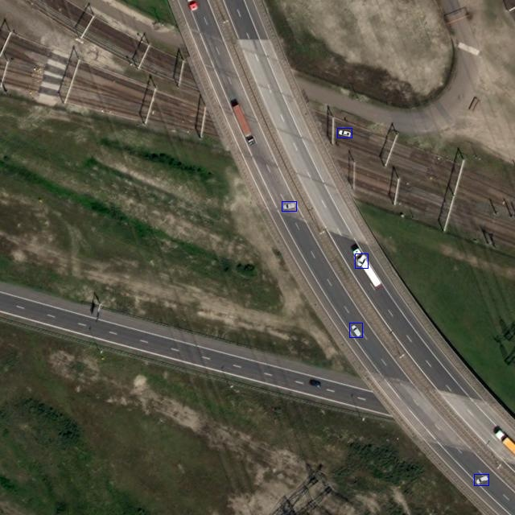
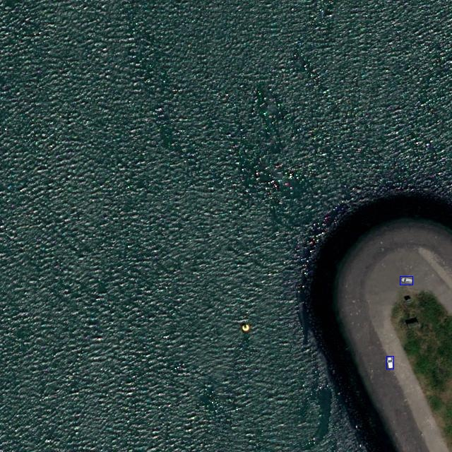

# Pyaugment
## Description

A Python package for object-based data augmentation. The data augmentation is formulated as an inpainting task, where given  a background image, a mask and a prompt describing the object to be added, a new image with a synthetic object is generated. For more automation, we add to the package a region proposer and a Bounding Box (BBox) generator module, which would spare the user the struggle of manually creating the mask for the area to be inpainted. The package is composed of the following modules: 

- **Region proposer:** Given an image and a text prompt describing the background in which the desired object could be placed, the region proposer returns a segmented background region.
- **Size estimator:** Out of a size range specified by the user, the size estimator module randomly samples the height and weight of the BBox. 
- **BBox generator:** Using the output of the region proposer and the output of the size estimator, the BBox generator returns a list of BBoxes in which objects can be placed, ensuring that they do not overlap. The current BBox generator supports saving the BBoxes in YOLO format, so the new dataset can be easily used for object detection tasks.
- **Object inpainter:** Given a background image, prompts describing the desired objects and BBoxes, the object inpainter generates a synthetic objects such as it is blended with the background. 
## Installation
To use this package, ensure you meet the following requirements:
- Python Version: Python 3.8.10
- 16 GPU memory

To install the package, you can use pip:
```bash
$ pip install git+ssh://git@github.com/ksai2324/pyaugment.git@master#egg=pyaugment
```

## Setup
To be able to use the package, you need to have the following structure: 
```plaintext
project_directory/
├── conditions/
│   ├── object_name_1/
│   │   ├── condition_1.png
│   │   ├── ...
│   ├── ...
├── models/
│   ├── SEEM/
│   │   ├── (SEEM model files)
│   ├── Grounded_SAM/
│   │   ├── (Grounded SAM model files)
├── object_specifications.json
├── yolo_dataset/
│   ├── images/
│   ├── labels/
```
- The conditions folder is needed if the inpainting approach requires image conditioning, such as the Canny_Edge_Controlnet based approach. Under the object folders, conditions are stored, for each generated object, a condition is randomly sampled from the list, to ensure better generation quality and more accurate size estimation, condition images should be cropped around the condition, i.e. the less empty background the more accurate the generation.

- Models: This directory stores pre-downloadable models. Currently, the package supports SEEM and Grounded_SAM models for the region proposer module. To download these models, use the download_models.sh script. Run download_models.sh SEEM to download the SEEM model or download_models.sh GSAM for Grounded SAM.

- yolo_dataset: This folder holds your initial dataset, including images and labels.

- object_specifications.json: This JSON file is where you specify object details, including the path to the conditions folder, object names, backgrounds, IDs, and size ranges. Ensure that object IDs align with those in your initial YOLO dataset. The object specifications.json should have this structure: 

```json
{
    "Conditions": "<conditions>",
    "Objects": [
        {
            "Name": "<object_name>",
            "id": <object_id>,
            "Background": [
                "<background_for_object>"
            ],
            "Height_range": [
                <min_height>,
                <max_height>
            ],
            "Width_range": [
                <min_width>,
                <max_width>
            ]
        }
    ]
}
```

## Usage

To perform object-based data augmentation with pyaugment, follow these steps:

1. **Load Region Proposer**: Initialize the region proposer module.

2. **Load Bounding Box (BBox) Generator**: Set up the BBox generator module.

3. **Load Object Inpainter**: Configure the object inpainter module.

4. **For Each Object**:

    a. **Get Object Size**: Estimate the size of the object.

    b. **Get Relevant Generation Region**: Determine the region for generating the object.

    c. **Generate Bounding Boxes (BBoxes)**: Create bounding boxes for object placement.
    
    d. **Inpaint Objects**: Use inpainting to generate objects within the specified region.

In the `main.py` script, we provide an example of the entire pipeline using a SEEM model for the region proposer and the Canny Edge ControlNet for inpainting. You can run the script with the following command:

```bash
python3 main.py \
    --object_specifications path/to/object_specifications.json \
    --yolo_ds_path path/to/your/yolo_dataset \
    --config_dir path/to/seem_configuration.yaml \
    --controlnet_checkpoint your/controlnet/checkpoint \
    --inpainting_model_checkpoint your/inpainting/model_checkpoint \
    --n_objects_range 2 7
```

## Example
The pipeline has been developed for, and tested on, arial imagery. However, it can be applied to any other image data. Here are some examples of data generated using the pipeline.

### Generating cars and trees on drone images
<div style="display: flex; justify-content: center; align-items: center;">
  
  
</div>

### Generating cars on satellite images
<div style="display: flex; justify-content: center; align-items: center;">
  
  
</div>

**Note:** 
The objects were generated using ControlNet, a model trained on drone imagery. These objects were extracted from drone scenes, scaled to enhance model learning, and placed on a white background. Image prompts were created using the canny edges of the objects, while the text prompt used for training was "A top view of {object} as seen from a satellite." For more details on fine-tuning ControlNet, please refer to the [ControlNet GitHub repository](https://github.com/lllyasviel/ControlNet).

## Credits
This package has been developed by building upon the work of various authors and their open-source projects. I would like to express my appreciation to the following projects and their creators, as they served as essential sources of inspiration and knowledge for the development of this package:
- [ControlNetInpaint](https://github.com/mikonvergence/ControlNetInpaint)
- [Diffusers](https://github.com/huggingface/diffusers)
- [ControlNet](https://github.com/lllyasviel/ControlNet)
- [SEEM](https://github.com/UX-Decoder/Segment-Everything-Everywhere-All-At-Once/tree/main)
- [Grounding-SAM](https://github.com/UX-Decoder/Segment-Everything-Everywhere-All-At-Once/tree/main)